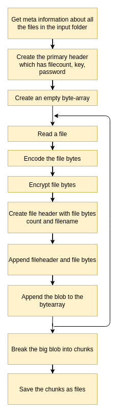
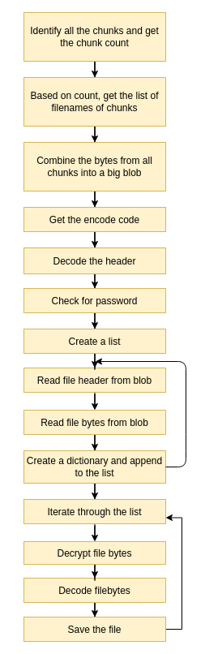

# En_Dec

En_Dec is a tool to store files in the form of chunks.

# Features

  - Convert all files or specific category of files into chunks
  - Encryption support 
  - Password protection
  - Custom Chunk size

## Usage
En_Dec requires python3.6.
### Setup Environment
```sh
sudo apt install python3
````
For now, tested only on linux 
To **encode** files, use command 
```python
python3 encode.py <input_directoryname> <output_directoryname>
```
To **decode** files, use command
```python
python3 decode.py <input_directoryname> <output_directoryname>
```
### Flags
##### For encode file
* -cs <chunk_size> (in bytes. By default is 100kB i.e. 100000)
* -k <key> (0-255 for default encryption. By default is 56)
* -f <categories> (images,videos,docs,prog. By default all files in the directory are chunked. If categories are mentioned, then only those type of files are chunked)
* -p (enable password protection. By default password protection is off)

### Usage examples
Flags start with "-". If "-" is not there, it assumes it is the name of directory. 
Be it encoding or decoding, 
First such argument without "-" is considered to be name of input directory (from where files has to be read)
Second such argument without "-" is considered to be name of output directory (name of directory where output is to be stored)

#### Usages of encode.py
By default, it expects input files in a directory named "testit". 
```python
python3 encode.py 
```
will encode all files in "testit" directory. 
You can change it by specifying the name of input directory as argument 
```python
python3 encode.py my_dir
```
By default, the program will put all chunks in a directory named "encrypted". 
Thus, the above command will encode all files from my_dir and store chunks in "encrypted" directory.
You can change it by specifying the name of output directory as argument 
```python
python3 encode.py my_dir chunks_dir
```
will encode all files from my_dir and store chunks in chunks_dir directory.

By default, the chunk size is 100000 Bytes (100kB). You can change it using flag -cs
```python
python3 encode.py my_dir chunks_dir -cs 1000000
```

By default, the project comes with a simple byte level encryption and the key for it is 56. You can change it using flag -k
```python
python3 encode.py my_dir chunks_dir -k 75  
```
(Note that by default 4 Bytes are allocated in header to store the key. Store key as per your encryption algorithm. The default algo needs key between 0-255)

-f  <comma seperated list. Possible elements : images,videos,docs,prog> (consider only these kind of files to encrypt)
By default, it would try to encode all the files in the directory. To encode specific types of files, you can use flag -f
```python
python3 encode.py my_dir chunks_dir -f images 
```
encodes only image type of files from input directory
```python
python3 encode.py my_dir chunks_dir -f images,videos
```
encodes image and video type of files from input directory
(Right now, 4 categories are supported. images, videos, docs, prog. Check the formats for each category in flag_and_args.py)

By default, password protection is disabled. To enable it, use flag -p
```python
python3 encode.py my_dir chunks_dir -p
```
will ask for password before encoding. And will be required while decoding.
-d  (print debugging statements)

While solving errors, debugging statements are useful. But not always. By default it's off. Turn debugging statements on by using flag -d
```python
python3 encode.py my_dir chunks_dir -d
```
will print debugging statements while executing.
By default basic warnings are shown. To supress them, use flag -sw

Note that there is no ordering for anything. Just make sure the argument for a flag is right next to it. 
```python
python3 encode.py -cs 1000000 my_dir -k 89 chunks_dir -d -p
```
will work.

#### Usages of decode.py
-d  (print debugging statements)
(All necessary details are included in the header itself, so that user need not remember it while decdoding)
### Add your implementation

1. Introduction
For any reason like (storing files such that they cannot be opened by anyone else, or chunk bunch of files into fixed sized chunks say 1GB to easily upload and store it on cloud, or any other reasons) you might require to convert some files into fixed sized chunks. The first component of the project (the process of encoding) is dedicated to do this. The encoding and decoding processes work in a pipeline fashion to make it customizable. In short 
files -> encoding -> chunks
chunks -> decoding -> files
Additional details in respective section.

2. Encoding 
This component converts files into chunks. But there is added fun to this. 
At first, idea was to simply read the files, combine the binary data and break it into chunks. But what if, we add other stuff in this process? As of now, I have added 2 more stages, encode file and encrypt data. The files can be encoded as per the format into it's compressed representation. Further, those bytes can be encrypted before they are converted into chunks. Best part is, you can add your own encoding and encrypting mechanisms or change other details in your implementation. Also, each file here will also have a header which can store additional information you want to store.




3. Decoding
This component identifies and converts chunks into original files.
The stages followed while encoding, are performed in a reverse manner while decoding. First, all the data from chunks is combined to form a big blob. Then the header is decoded to get the meta information like number of files, decrpytion key, is it password protected and if yes, hash of the password, and so on. Then, the data is read for every file, decrypted and then decoded to recover the original file from it. 




[//]: # 
   [git-repo-url]: <https://github.com/gaurav-kc/Enc_dec.git>

